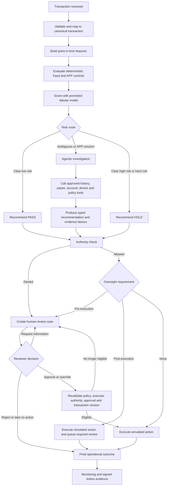

# Fraud Intelligence & Agentic Risk Platform API

A production-shaped fintech risk showcase in development. It demonstrates deterministic fraud controls, supervised-tabular-ML evaluation mechanics, agentic investigation, delegated authority, human review, simulated payment actions, and independently signed Arbiris evidence without claiming to be a production payment or compliance service.

The repository contains the original fraud-compliance demo API and a separate
repository-owned, SDK-free bounded LangGraph investigation for MVP 3. The
legacy routes run `fraud_compliance_agent_v2` from the pinned
[Arbiris SDK](https://github.com/ags911/arbiris-sdk); the new S01–S05 showcase
route runs without that private dependency. The later operational capabilities
described below are not all implemented or approved.

## Product status

| Area | Available now | Approved target |
|---|---|---|
| API | Health, legacy scenario/custom/preset routes, benchmark summary, and SDK-free S01–S05 showcase stream | Pure scoring, durable processing, fraud reviews and operational monitoring |
| Decisioning | Deterministic Sim A and APP-scam Sim B | Point-in-time features, deterministic controls, calibrated tabular ML and risk routing |
| Investigation | Private-SDK Sim B uses an LLM for every transaction not stopped by its pre-filter | Public showcase: only S04 enters the normal bounded agent path and S05 exercises its failure path; operational F4 remains deferred |
| Actions | Decision recommendations in a demo pipeline | Idempotent simulated actions behind separate authority and oversight gates |
| Human review | State placeholder only | Authenticated, versioned review queue and linked decisions |
| Persistence | Local JSON evidence output | PostgreSQL for fraud-platform operational state; governance records are sent to Arbiris |
| Arbiris integration | Signed AARF-0.2 intent records and evidence-pack demo | Outbound governance-record integration only; no governance or evidence-pack API/UI in this product |
| Operations | SSE progress stream | Structured telemetry, decision-service health and historical replay |

This is currently an unauthenticated, single-operator demonstration. It must not be treated as a production payment service, and every payment action in the target system remains simulated.

## User journey

The main user is a fraud operator monitoring payment decisions. Fraud reviewers and administrators enter the same lifecycle at controlled points. AI-governance and evidence-pack users work in the separate Arbiris product.



Applicable deterministic APP checks run before any fast release. Only the contextual LLM investigation moves to the slow path. A low ML fraud probability cannot bypass a hard policy or an independent APP-scam signal.

Authority and oversight answer different questions:

- **Authority:** is this actor allowed to propose or perform this action within its monetary, functional and policy scope?
- **Oversight:** does the approved action tier require a human before execution, a review after execution, or no human review?

Passing the authority check is never sufficient by itself. A queued post-execution review is also not recorded as a completed review. Phase 0 must approve the exact mapping of pending oversight to the current Arbiris SDK before that execution mode is enabled.

### Fraud operator

The operator submits or selects a transaction and sees its validated facts, feature snapshot, deterministic results, model probability, reason codes and recommended route. Clear cases remain on the low-latency path. Cases requiring context open an investigation whose tool calls and results are traceable. Stateful processing continues durably even if the browser or SSE connection disconnects; this durability is part of the target contract to be specified in Phase 0.

### Fraud reviewer

A reviewer sees the transaction, rules, model and policy versions, agent recommendation, evidence factors, authority result, oversight requirement and linked Arbiris record IDs. They claim the case and approve, override, request more information or record a final decision. Every mutation carries an expected `review_version`; stale updates fail instead of overwriting another reviewer's work. Before an approved action executes, the platform revalidates the action, transaction version, policy, authority and approval scope.

### Administrator

An administrator manages fraud rules, operational access, action limits and service integrations. Model development and promotion occur outside the fraud dashboard under an approved release process; the fraud service consumes only the currently promoted model artifact and records its version with each decision.

### Arbiris boundary

The fraud platform emits the material decision and action records required by the Arbiris integration and may retain delivery status and linked Arbiris record IDs for operational support. AI-governance review, signed-record exploration, evidence-pack assembly and evidence-pack retrieval belong exclusively to the separate Arbiris API and dashboard.

## API journey and side effects

The target API separates scoring from processing:

```text
POST /risk/score
validate → features → deterministic controls → ML → route recommendation
```

`POST /risk/score` never executes a payment action. It may persist the operational prediction record and emit the agreed Arbiris integration payload according to the Phase 0 contract.

```text
POST /transactions/{transaction_id}/process
score → route → optional investigation → authority → oversight → review if required → simulated action
```

Processing is stateful and idempotent. `PASS` is a recommendation; `RELEASE` is a simulated action. Historical replay creates a new comparison result and never re-executes an action.

## Architecture boundaries

The v1 deployment is a FastAPI modular monolith with PostgreSQL, a promoted-model artifact loader and the packaged Arbiris integration SDK.

- The fraud application owns transaction ingestion, features, rules, ML scoring, routing, investigation, operational authority, review execution, simulated actions and monitoring.
- Arbiris owns the intent-record schema, signing, governance storage, governance APIs, governance dashboard and evidence-pack assembly/retrieval.
- The fraud platform does not expose AI-governance or evidence-pack features. It only emits agreed records to Arbiris and tracks integration delivery for operational support.
- Operational telemetry belongs in logs, traces, metrics or the operational event store. Material accountability events map to signed records or linked governance artifacts.
- The production runtime will consume the packaged `arbiris` SDK. It will not depend on `arbiris-sdk/examples/...`.

The current API still imports the SDK example by adding the submodule root to `sys.path`. Phase 0 first characterizes scenarios A–F; later implementation moves owned fraud behavior behind stable application interfaces while retaining the example as a compatibility reference.

The public-showcase replacement lives under
`server/showcase_investigation/` against the accepted
`public-showcase-api.v1.openapi.json` and
`public-showcase-events.v1.schema.json` contracts. It will not import or copy
the private SDK. Recorded demonstration playback is the
default public experience; a clearly labelled live Groq path is optional and
must remain behind the accepted admission, quota and kill-switch controls. MVP
3 will use deterministic fixture eligibility and expose no numeric runtime
fraud-model score or decision threshold; those remain F3a work.

The accepted initial agent allowlist is `get_payee_evidence`,
`get_account_activity_evidence`, and `get_device_session_evidence`. They are
read-only synthetic fixture tools. ADR-016 accepts the recorded S04 payee and
device evidence; account-activity evidence remains unspecified and must fail
with `tool_failed` if invoked. The accepted budget is three total calls and one
call per tool; exhaustion remains incomplete with no action.

Provider, tool, output-validation, timeout and budget failures all use the same
public semantics: incomplete investigation, fail-safe HOLD recommendation,
authority not evaluated, no action, and a stable redacted reason code.

Recorded playback is continuously public. Anonymous live Groq mode defaults
off and may be enabled only for a controlled operator-run demonstration window.
Always-on live access remains prohibited until reliable provider-side spending
or durable distributed quota controls exist.

Accepted controlled-window limits are one concurrent run, two per observed
client per 10 minutes, ten per process, 30 minutes maximum and a 45-second
overall timeout. Client keys must come from trusted ingress metadata. These
process-local counters reset on restart and are not a durable quota.

Groq is the sole optional live provider. Its credential and allowlisted model
selection stay server-side; each live run records its provider and model
identifier. The adapter may emit only schema-validated structured output into
ephemeral contract state. Raw prompts, raw provider output, hidden reasoning
and provider exceptions are not logged or exposed. There is no second-LLM
fallback: unavailable live execution returns to labelled recorded playback.

During migration, the private-SDK A–F workflow remains a local-only
compatibility reference and never enters the public runtime. Keep it until the
S01–S08 contracts and fixtures and the replacement's runtime-evaluation, browser-acceptance
and public-container checks pass. Cutover then requires an explicit decision.
Retirement removes the legacy workflow from the active application and
dependency path while preserving its characterization documents and Git
history.

## Delivery gate

Only Phase 0 is approved. It covers contracts, characterization tests, the Plaid mapping, training target and corpus selection, AARF evidence mapping, action-tier classification, authority and oversight semantics, persistence design and architecture decision records.

- [Phase 0 backlog](docs/planning/phase-0-backlog.md)
- [Phase 0 PRD review and open decision register](docs/planning/phase-0-prd-review.md)
- [ADR template](docs/adr/0000-template.md)

Implementation beyond Phase 0 begins only after its artifacts and exit packet are reviewed and the next scope is approved.

## Dashboard prototype

`prototypes/dashboard/` contains a retained standalone Vite and React prototype built from the official shadcn/ui Nova preset and `dashboard-01` registry block. It is not the active operator console; `apps/web` owns that surface. The prototype demonstrates transaction monitoring, review queues, rules, decision insights, and integration health only. Arbiris governance and evidence-pack features are intentionally excluded.

```bash
cd dashboard
npm install
npm run dev
```

## Run the current demo

### Setup

```bash
git clone --recurse-submodules https://github.com/ags911/fraud-compliance-agent.git
cd fraud-compliance-agent/apps/api

# If cloned without submodules (this needs access to the private Arbiris SDK):
git submodule update --init --recursive

uv sync --extra sdk    # with the private SDK: the full demo pipeline
cp .env.example .env
```

Without access to the private SDK, clone without `--recurse-submodules` and use
`uv sync --frozen` instead (`--frozen` skips validating the absent SDK). The API
still starts: `/health`, `/demo/model-summary`, and recorded
`/showcase/investigations` work, while `/scenarios` and the legacy run routes
return `503 demo_pipeline_unavailable`.

The safe default sets `DEMO_ALLOW_EXTERNAL_INVESTIGATION=false`: Sim B follows
its deterministic provider-unavailable path and makes no Groq request. For an
authorised local demonstration only, set `GROQ_API_KEY` and explicitly set
`DEMO_ALLOW_EXTERNAL_INVESTIGATION=true`. To keep signatures stable across
restarts, set `ARBIRIS_LOCAL_SIGNING_KEY_PATH` to a persistent ECDSA P-256
private key. The default ephemeral key is suitable only for the local demo.

### Start the API

```bash
uv run uvicorn server.main:app --reload --port 8010
```

Current endpoints:

| Method | Endpoint | Current behavior |
|---|---|---|
| `GET` | `/health` | Liveness check |
| `GET` | `/scenarios` | List fixed scenarios A–F |
| `POST` | `/run` | Run a custom transaction and stream node updates over SSE |
| `POST` | `/run/preset/{scenario_id}` | Run a preset, optionally simulating an LLM outage |
| `POST` | `/showcase/investigations` | Stream accepted recorded S01–S05 or an admitted live S04 investigation |

```bash
curl -N -X POST http://localhost:8010/run/preset/A

curl -N -X POST http://localhost:8010/showcase/investigations \
  -H 'Content-Type: application/json' \
  -d '{"scenario_id":"S04","execution_mode":"recorded"}'
```

Recorded playback needs no credential. Optional live S04 additionally requires
`SHOWCASE_LIVE_ENABLED=true`, `GROQ_API_KEY`, `SHOWCASE_GROQ_MODEL`, and the same
model identifier in `SHOWCASE_GROQ_ALLOWED_MODELS`. There is intentionally no
default model identifier. The 30-minute enablement window starts with the API
process and all admission counters reset on restart.

Legacy `/run` SSE messages contain completed SDK node results and, when
available, signed-record metadata. The new showcase stream uses the accepted
typed event vocabulary and stable failure reasons. Both streams end with a
named `done` event.

## SDK pin

`vendor/arbiris-sdk` is a pinned git submodule because the current demo executes an SDK teaching example that is deliberately outside the packaged distribution. Update the pin explicitly:

The current reviewed pin is `27844250f926fe0ade2250dd99975c7283defc80`.

```bash
cd vendor/arbiris-sdk
git fetch
git checkout <commit-or-tag>
cd ../..
git add vendor/arbiris-sdk
git commit -m "Bump arbiris-sdk pin"
```

Do not rewrite historical AARF records during an SDK update. Existing signed payloads must remain verifiable under their original schema and key.

## Run it as a container

The showcase image is built from the repository root because it includes the
sanitised model-summary evidence plus accepted showcase safeguards and fixtures:

```bash
docker build -f apps/api/Dockerfile -t fraud-compliance-agent-api .
docker run --rm -p 8000:8000 fraud-compliance-agent-api
```

The image installs the runtime dependencies only. The private SDK is excluded,
so `/scenarios` and the run routes answer `503 demo_pipeline_unavailable` while
`/health` and `/demo/model-summary` work; the offline `modelling` library is
excluded as well. It runs as a non-root user on port 8000, and a deployment must
set `ALLOWED_ORIGINS` and may set `FCA_EVIDENCE_ROOT` if the evidence files are
mounted elsewhere. See [`infra/README.md`](../../infra/README.md).

This is the current image behaviour, not the desired public end state. The MVP
3 plan replaces the unavailable run path with the SDK-free bounded
investigation and recorded playback while preserving the image's negative
private-SDK check.

## Current demo deployment

The existing demonstration can run on Render using:

```text
uv run uvicorn server.main:app --host 0.0.0.0 --port $PORT
```

Configure explicit `ALLOWED_ORIGINS` and keep
`DEMO_ALLOW_EXTERNAL_INVESTIGATION=false` for the public showcase. If a
separately controlled deployment opts into Groq, configure its key server-side
and add admission/cost controls. Prefer a persistent
`ARBIRIS_LOCAL_SIGNING_KEY_PATH` only when later verification is implemented.
The SDK submodule is fetched recursively during the build. This deployment
remains the unauthenticated demonstration described above; it is not the target
production deployment.
