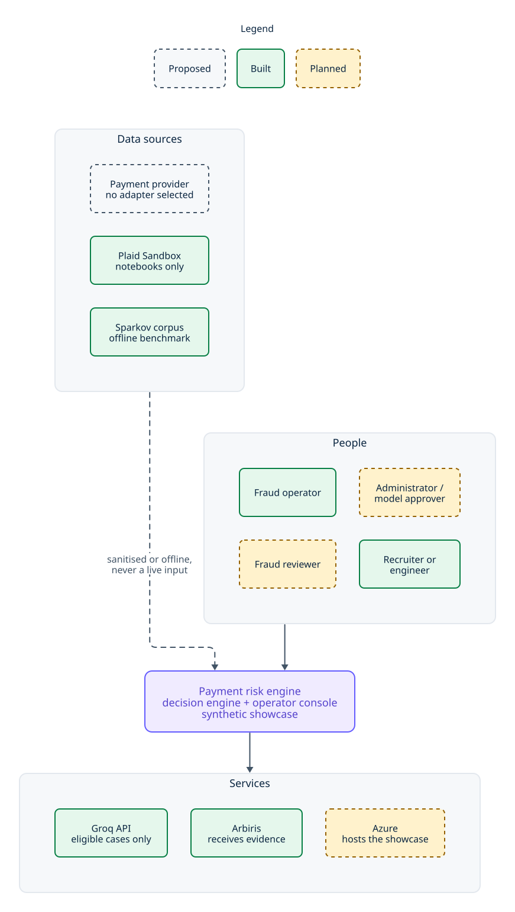
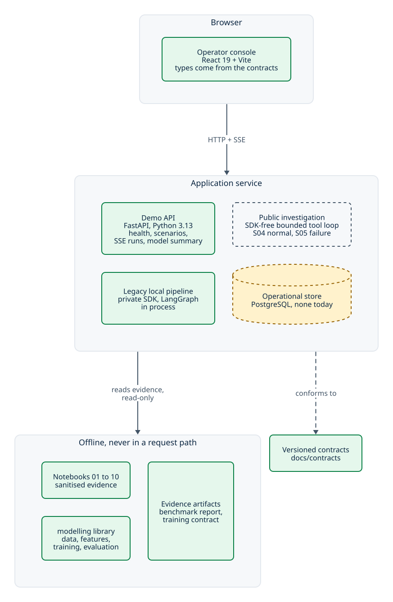
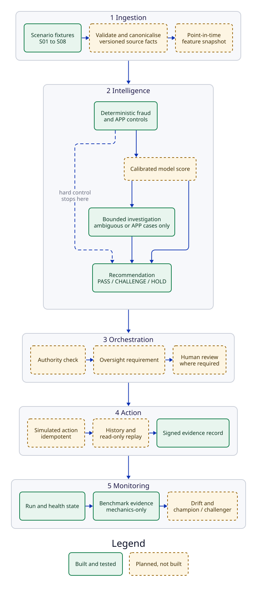
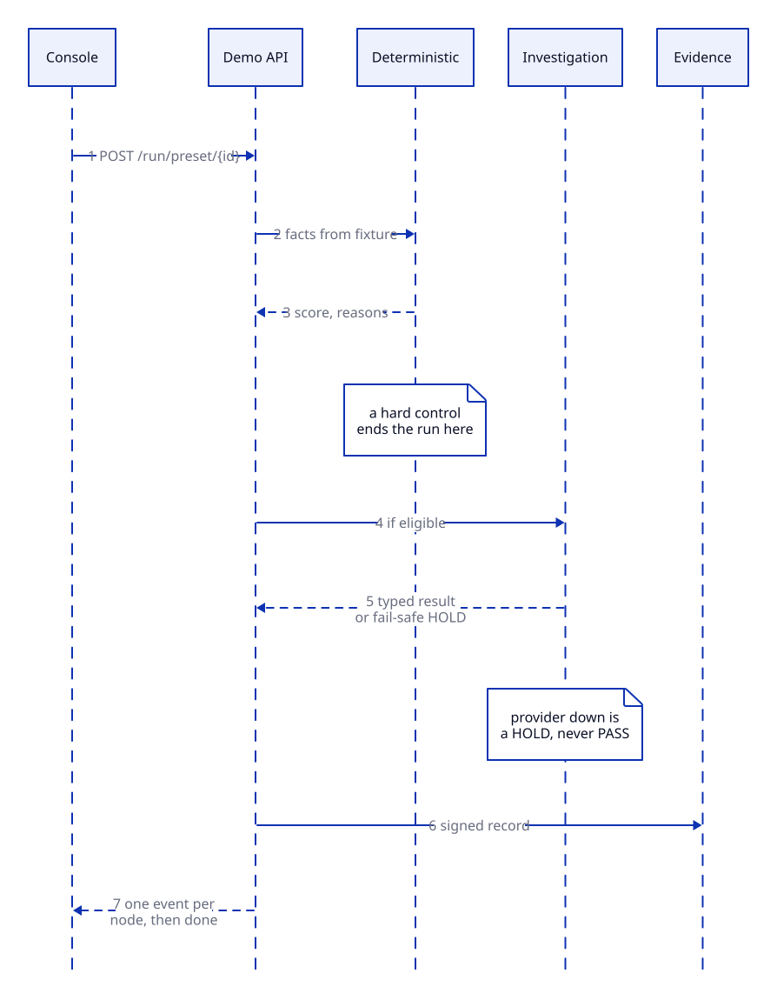
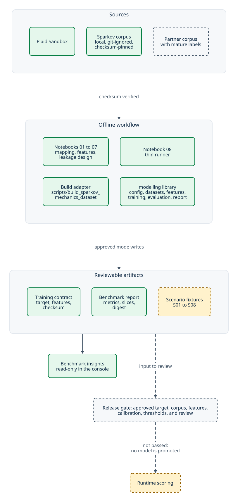
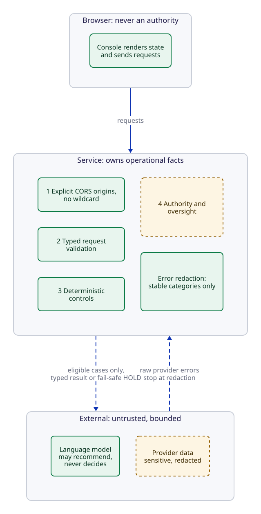
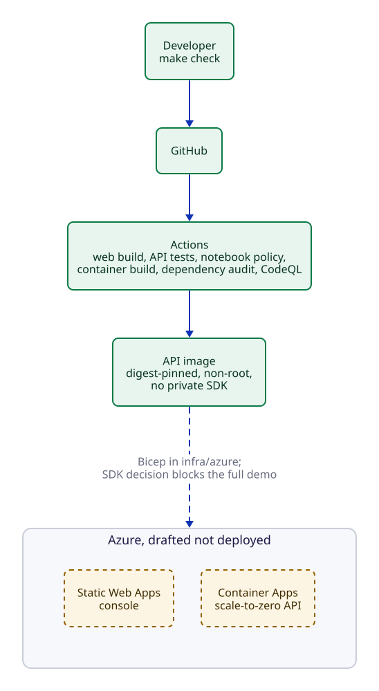

# System architecture

How the payment-risk engine is put together, from a provider event to an
operator's screen, and what part of it exists today.

This document describes structure. It does not approve anything: the product
baseline is the [PRD](../product/prd.md), delivery order is the
[implementation plan](../product/implementation-plan.md), and the rules every
contributor follows are in [project context](../project-context.md). Where those
disagree with a picture here, they win and this file is wrong.

## How to read the diagrams

Every diagram is a [D2](https://d2lang.com) source in [`diagrams/`](diagrams/)
rendered to SVG, so it displays in any viewer, and the source is committed beside
each one. Regenerate them with `make architecture-diagrams` (needs `brew install
d2`).

They follow the console's design tokens, and a few rules keep them consistent.
The rules live in [`_shared.d2`](diagrams/_shared.d2), and a test in CI checks the
committed SVGs against them:

- **One scale.** Every diagram is under 900 units wide, so GitHub shows it at
  natural size and the text is the same size in all of them.
- **Vertical, never smaller.** A view that is wider than that is stacked
  vertically. It is not shrunk, and its font size is not reduced to make it fit.
  A sequence diagram cannot stack, so it keeps to the limit with short labels.
- **One look.** Colours are the console's Payments tokens and the type is Inter,
  its data font, embedded in each SVG. Colour means build state only, and a dashed
  border repeats it so it survives greyscale.
- **Any page.** There is no hard background, and each SVG carries a
  `prefers-color-scheme: dark` palette. The dark colours are derived for this
  purpose, because the Payments system has no dark theme.
- **Neutral arrows.** Every connection is one colour, so an arrow means direction
  and nothing else.

Every node carries its build state, because a diagram that mixes what runs with
what is planned is how a demo becomes a false claim.

| State | Meaning |
| --- | --- |
| **Built** | Implemented in this repository and covered by tests. |
| **Planned** | Approved in the PRD or the delivery plan, not built. |
| **Proposed** | Under review; no contract, no implementation, no commitment. |

One rule runs through all of it: **everything here is synthetic**. No real
payment is approved, released, or executed anywhere in this system, and no
score, model, or language model may make that decision. Deterministic controls
come first; a model recommends; authority, oversight, and human review decide.

## 1. System context

Who uses the system and what it talks to.

Source: [`diagrams/context.d2`](diagrams/context.d2).

The dotted edges matter as much as the solid ones. Plaid informs the canonical
mapping through sanitised notebooks and never serves a request. Sparkov feeds a
mechanics-only benchmark and never a runtime score. No provider adapter is
selected, so the system's decision input today is a deterministic fixture.

## 2. Containers

What is deployed, and what is deliberately absent.

Source: [`diagrams/containers.d2`](diagrams/containers.d2).

The API is a modular monolith on purpose. The PRD keeps the deterministic tier
and the investigation tier in one process until profiling shows a real need to
split them, so a safety decision never waits on a network hop.

There is no database. Run state is ephemeral, which is why the console must not
present anything as durable history, and why idempotency and replay remain
planned rather than claimed.

## 3. The pipeline

Ingestion, intelligence, orchestration, action, monitoring — and what guards
each stage.

Source: [`diagrams/pipeline.d2`](diagrams/pipeline.d2).

Monitoring feeds back into the next *model decision* — a promotion, a threshold,
a retrain — through the release gate in section 4. There is no live path from an
evaluation result into a running score, which is why the chain above is a line
rather than a loop.

Stage by stage, with the constraint that defines it:

| Stage | What it does | Guardrail |
| --- | --- | --- |
| **Ingestion** | Turns a provider event into a versioned canonical transaction and a point-in-time feature snapshot. | Unavailable stays unavailable. A missing device, payee, or session fact is never manufactured from another source, and `unavailable` is not `zero` or `false`. |
| **Intelligence** | Runs deterministic fraud and APP controls, then a model score, then a bounded investigation only for cases that qualify. | Deterministic controls run **before** any model-assisted assessment. A low score cannot bypass a hard control, and the investigation is typed, allowlisted, and time-bounded. |
| **Orchestration** | Separates recommending from deciding: authority, then oversight, then review where required. | A recommendation is not an action. The browser never supplies authority; the server derives actor and tenant context. |
| **Action** | Produces a simulated outcome, durable history, replay, and a linked evidence record. | Every payment action is simulated. Duplicate processing never creates a second action, and replay repeats lineage, not effects. |
| **Monitoring** | Shows truthful run, health, and evaluation state; later, drift and champion/challenger. | No invented trend, accuracy, or false-positive figure. Zero, empty, and `Unavailable` are correct answers until recorded data exists. |

### What actually runs today

The current demo exercises a real slice of that pipeline end to end, in process,
over Server-Sent Events:

Source: [`diagrams/sequence.d2`](diagrams/sequence.d2).

The console renders loading, unavailable, error, and outage states from that
stream rather than inventing a completed decision. With the LLM provider
unconfigured — the default — the investigation stage fails safe to HOLD, and the
screen says so.

## 4. Data and model lifecycle

The path from a data source to a number on a screen, and the gate in the middle
that nothing crosses today.

Source: [`diagrams/lifecycle.d2`](diagrams/lifecycle.d2).

Three properties make this reproducible rather than decorative:

- **The dataset is pinned, not described.** The training contract names the
  local CSV and its SHA-256; an approved run refuses anything else, and the
  corpus itself is never committed.
- **The parameters are reviewable.** Seed, hyperparameters, threshold grid, and
  fixture shape live in `config/fast-path-model-training.v1.json`, not in a
  notebook cell.
- **The output is a signed-off artifact.** The report records its git revision,
  seed, configuration version, and a digest of its own payload, and only an
  approved-mode run may write the reviewed copy. The API serves that report
  read-only, after checking its status, feature list, and dataset checksum.

What the gate blocks is the whole point: there is no path from a trained model
to a payment decision. The benchmark is labelled Sparkov mechanics wherever it
appears.

## 5. Trust boundaries

Source: [`diagrams/trust.d2`](diagrams/trust.d2).

- The browser carries no authority. Roles, tenancy, and permissions are
  server-derived, and authentication is a prerequisite for the first mutable
  non-local endpoint rather than a later hardening step.
- The language model is treated as an untrusted, optional contributor: bounded
  tools, a timeout, and a fail-safe HOLD if it is unavailable.
- Provider data, tokens, raw errors, personal data, and model reasoning are
  sensitive. The stream emits stable error categories (`processing_timeout`,
  `processing_failed`), never a provider's message.

## 6. Deployment

Source: [`diagrams/deployment.d2`](diagrams/deployment.d2).

The image exists and is built and smoke-tested in CI, and reviewable Bicep for
the Static Web App, the scale-to-zero Container App, and a budget alert is in
`infra/azure/`. Nothing is deployed, and one decision blocks the full demo: the
image deliberately excludes the private Arbiris SDK, so `/scenarios` and both
`/run` routes answer `503 demo_pipeline_unavailable` and only `/health` and the
benchmark route work. Publishing the SDK in an image needs its own approval and
a reviewed supply-chain design. Free hosting is suitable only for a synthetic
demo, never as a production reliability decision.

## 7. Where each piece lives

| Concern | Location |
| --- | --- |
| Browser UI, routing, accessibility, browser tests | `apps/web` |
| Operational facts, routes, domain behaviour, API tests | `apps/api/server` |
| Offline training and evaluation, never imported by the API | `apps/api/modelling` |
| Versioned API and event contracts (the showcase OpenAPI and SSE event schema are frozen at v1.0) | `docs/contracts` |
| Reviewable, non-secret configuration | `config` |
| Reproducible evidence and experiment records | `notebooks`, `docs/experiments` |
| Deployment configuration and the container image | `apps/api/Dockerfile`, `infra` |
| Deterministic scenario fixtures | `fixtures` (specified, not yet populated) |

## 8. Open decisions

These are architecture-shaping and undecided. They are listed so a reader does
not mistake an absence for an oversight.

- **No provider adapter is selected.** Canonical money, direction, event time,
  account, payee, and source-revision semantics need an accepted contract before
  ingestion can be built.
- **No operational store.** Idempotency, durable history, review state, and
  replay all wait on that decision; the showcase is database-free today.
- **The public image cannot run the decision demo.** Without the private SDK the
  run routes are unavailable; the choices are approving the SDK in an image, or
  replacing the demo pipeline with first-party code.
- **No approved model target or threshold.** Any threshold, calibration method,
  or promotion rule is an explicit approved decision, not a default.
- **Two console shells coexist.** The Overview is the shadcn surface; the other
  pages keep the approved Payments shell until a migration is approved.
- **Authentication is absent.** It gates the first mutable non-local endpoint.
